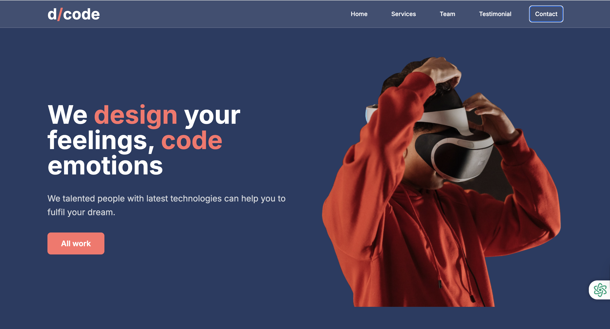

# Compony Portfolio Project

> **Note:** This is a sample landing page project. It is not a full-fledged website or production application. This repository contains only the frontend code for demonstration and portfolio purposes.

## Overview

This project is a modern, responsive landing page built with React, TypeScript, and Tailwind CSS. It showcases a clean design, smooth animations, and modular component structure. The page is intended as a sample for portfolio or demonstration use only.

- **Type:** Frontend-only (no backend, no authentication, no database)
- **Purpose:** Sample landing page for portfolio/demo
- **Tech Stack:** React, TypeScript, Tailwind CSS, GSAP, Vite

## Screenshot



*Screenshot of the landing page hero section showcasing the modern design and animations.*

## Features

- Responsive design for desktop and mobile
- Animated hero section and smooth scrolling
- Modular React components (NavBar, Home, Services, Team, Testimonials, Contact, Footer)
- Modern CSS with Tailwind and custom styles
- Well-commented, clean codebase

## Quick Start

1. **Clone the repository:**
   ```bash
   git clone https://github.com/your-username/compony_portfolio_project.git
   cd compony_portfolio_project
   ```

2. **Install dependencies:**
   ```bash
   npm install
   ```

3. **Run the development server:**
   ```bash
   npm run dev
   ```
   The app will be available at [http://localhost:3000](http://localhost:3000).

4. **Build for production:**
   ```bash
   npm run build
   ```

## Project Structure

```
compony_portfolio_project/
├── src/
│   ├── components/      # React components
│   │   ├── navBar.tsx
│   │   ├── home.tsx
│   │   ├── services.tsx
│   │   ├── team.tsx
│   │   ├── testimonials.tsx
│   │   ├── contact.tsx
│   │   └── footer.tsx
│   ├── assets/          # Images and static assets
│   │   └── images/
│   ├── styles/          # Tailwind and custom CSS
│   │   └── index.css
│   ├── App.tsx          # Main app component
│   ├── main.tsx         # Entry point
│   └── vite-env.d.ts    # Vite type definitions
├── sceenshorts/         # Screenshots
│   └── hero.png
├── index.html           # Main HTML file
├── package.json         # Project metadata and scripts
├── tailwind.config.js   # Tailwind CSS config
├── vite.config.ts       # Vite build config
├── tsconfig.json        # TypeScript config
├── vitest.config.ts     # Test config
├── postcss.config.js    # PostCSS config
├── .eslintrc.cjs        # ESLint config
├── .prettierrc          # Prettier config
├── .gitignore           # Git ignore rules
├── .nvmrc               # Node version
└── README.md            # Project documentation
```

## License

This project is for demonstration and educational purposes only. Feel free to use or adapt for your own portfolio.
